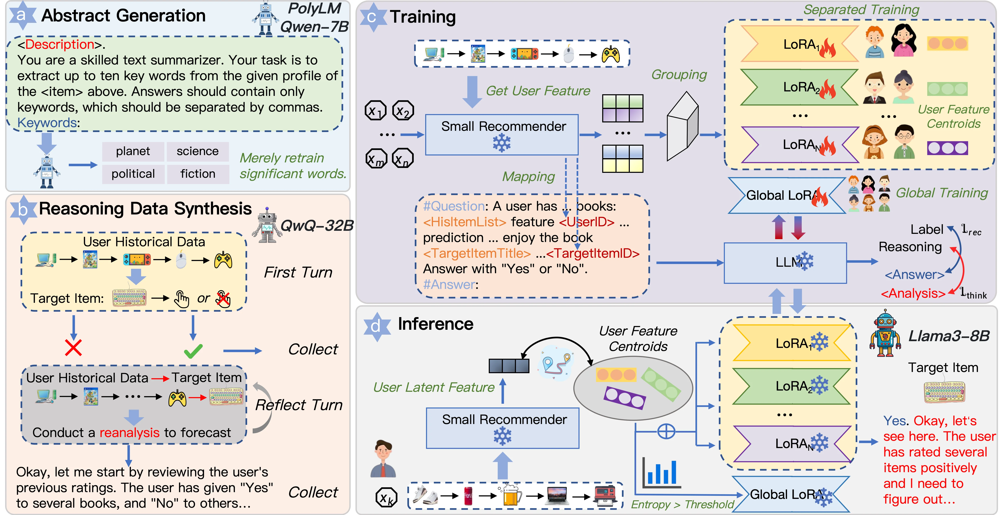

We are excited to share **ThinkRec**, our work on **thinking-based recommendation with large language models**, accepted to **The Web Conference (WWW) 2026**.

Modern recommender systems excel at predicting what users may prefer next, but they often struggle to answer a fundamental question:

> **Why is this recommendation made?**

Despite the recent success of LLM-based recommendation, most existing approaches still rely heavily on implicit pattern matching. They learn correlations from user interactions but rarely perform explicit reasoning about user preferences, limiting both recommendation quality and user trust.

ThinkRec takes a different perspective: instead of treating recommendation as a pure matching problem, we frame it as a **reasoning problem**.

## From matching to thinking

Current LLM recommenders largely resemble **System 1 thinking**—fast, intuitive, and driven by surface similarities. However, users with similar behaviors may have very different underlying motivations and preferences.

ThinkRec enables LLMs to **think before they recommend** through two key components:

* **Thinking Activation** — constructing reasoning traces that connect user history, preference analysis, and recommendation decisions, encouraging explicit reasoning during training.
* **Instance-wise Expert Fusion** — dynamically combining personalized LoRA experts based on user characteristics, balancing global knowledge with fine-grained personalization.

Together, these components allow ThinkRec to move beyond simple behavior matching and generate recommendations that are both more accurate and more interpretable.

## What do the experiments show?
| Methods | ML1M AUC | ML1M UAUC | ML1M NDCG@5 | ML1M MAP@5 | Yelp AUC | Yelp UAUC | Yelp NDCG@5 | Yelp MAP@5 | Book AUC | Book UAUC | Book NDCG@5 | Book MAP@5 |
|---|---:|---:|---:|---:|---:|---:|---:|---:|---:|---:|---:|---:|
| MF | 0.6401 | 0.6079 | 0.7286 | 0.4520 | 0.5838 | 0.5389 | 0.8120 | 0.2552 | 0.6592 | 0.5527 | 0.6805 | 0.2887 |
| LightGCN | 0.6140 | 0.6230 | 0.7333 | 0.4600 | 0.5360 | 0.5179 | 0.8076 | 0.2520 | 0.5622 | 0.4985 | 0.6406 | 0.2598 |
| SASRec | 0.6956 | 0.6687 | 0.7663 | _0.4747_ | 0.6184 | **0.6096** | 0.8564 | 0.2785 | 0.5411 | 0.5197 | 0.6550 | 0.2701 |
| gSASRec | 0.7043 | _0.6690_ | 0.7650 | 0.4693 | 0.6200 | 0.6051 | **0.8586** | _0.2792_ | 0.6187 | 0.5546 | 0.6858 | 0.2964 |
| Prompt4NR | 0.6936 | 0.6433 | 0.7665 | 0.4652 | 0.6272 | 0.6034 | 0.8348 | 0.2705 | 0.6764 | _0.5699_ | **0.7023** | _0.3048_ |
| TALLRec | 0.6872 | 0.6553 | _0.7683_ | 0.4706 | 0.5334 | 0.5206 | 0.7988 | 0.2538 | 0.6632 | 0.5568 | _0.7023_ | **0.3049** |
| CoLLM | _0.7141_ | 0.6672 | 0.7585 | 0.4647 | _0.6373_ | 0.5961 | 0.8420 | 0.2734 | _0.7830_ | 0.5672 | 0.6917 | 0.2968 |
| **Ours** | **0.7764** | **0.6775** | **0.7747** | **0.4774** | **0.6955** | _0.6065_ | _0.8585_ | **0.2826** | **0.8302** | **0.5705** | 0.6858 | 0.2977 |

We evaluate ThinkRec on three widely used recommendation benchmarks: **MovieLens-1M**, **Yelp**, and **BookCrossing**, comparing against strong traditional and LLM-based baselines.

ThinkRec consistently achieves the best overall performance across ranking metrics such as AUC, UAUC, NDCG@5, and MAP@5. In particular, it improves upon the previous state-of-the-art CoLLM by:

* **+8.72% AUC on MovieLens-1M**
* **+9.13% AUC on Yelp**

Beyond recommendation accuracy, ThinkRec also produces higher-quality explanations. Compared with existing LLM-based methods, it achieves average relative improvements of:

* **+56.54% on METEOR**
* **+23.35% on BLEURT**

These results suggest that explicit reasoning not only improves recommendation performance but also enhances transparency and user trust.

| Methods | ML1M METEOR | ML1M BLEURT | Yelp METEOR | Yelp BLEURT | Book METEOR | Book BLEURT |
|---|---:|---:|---:|---:|---:|---:|
| Prompt4NR | 0.0010 | 0.2013 | 0.0205 | 0.1675 | 0.0003 | _0.1957_ |
| TALLRec | _0.0275_ | _0.2607_ | _0.0379_ | _0.2420_ | _0.0301_ | 0.1931 |
| CoLLM | 0.0003 | 0.1626 | 0.0001 | 0.1785 | 0.0097 | 0.1636 |
| **Ours** | **0.0333** | **0.3104** | **0.0616** | **0.2683** | **0.0546** | **0.2828** |

Further analysis reveals that reasoning and personalization are highly complementary. Removing either the thinking component or the expert fusion mechanism leads to noticeable performance degradation, highlighting the importance of combining explicit reasoning with personalized modeling.

## Why does it matter?

We believe recommendation systems are evolving from:

> predicting what users may click

to:

> understanding why users make choices.

ThinkRec represents a step toward this transition by integrating reasoning directly into the recommendation process. More broadly, the idea of combining explicit reasoning with dynamic expert selection may extend beyond recommendation to areas such as expert routing, personalized AI assistants, and multi-agent systems.

The complete implementation, including data preprocessing, reasoning construction, expert fusion, training scripts, and evaluation code, is available on GitHub.

If you are interested in LLM-based recommendation, personalized reasoning, or expert routing, we would love to hear your feedback.

## Further reading

- Paper: [ThinkRec on arXiv](https://arxiv.org/abs/2505.15091)
- Code & project page: [github.com/Yu-Qi-hang/ThinkRec](https://github.com/Yu-Qi-hang/ThinkRec)
